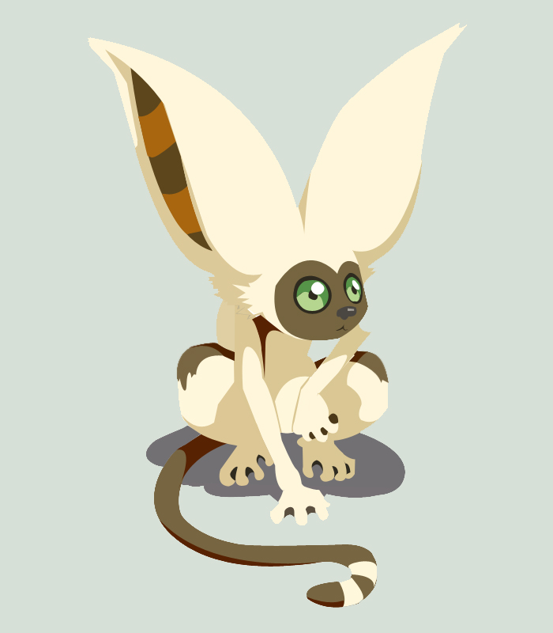

# Momo Animator

</img>

## Description

Momo is a simple javascript animation library that animates elements once they are scrolled into view. Named after the flying lemur from [Avatar: The Last Airbender](https://en.wikipedia.org/wiki/Avatar:_The_Last_Airbender)

## Getting Started

### Add Momo using a script tag on your page.

Momo will be added to the `window` with namespace `Momo` and will be accessible on all pages. It will be initilized with the default [`MomoOptions`](#momo-options); use the [`setGlobalOptions`](#momo-setGlobalOptions) method to change it.

```html
<script src="/path/to/momo.js"></script>
```

```javascript
// Adding your global options
Momo.setGlobalOptions({
  duration: 2000,
  curve: "cubic-bezier(0.65, 0, 0.35, 1)",
});
```

## Usage

### Animating a single element

To animate a single element, pass the selector of the element and use the `animate` function, along with your [`MomoOptions`](#momo-options).

```html
<h2 id="fooElement" class="momo" data-animation="fade-in-right">
  Momo is pretty cool
</h2>
```

```js
const fooAnimator = Momo.animate("#fooElement", {
  duration: 2500,
  delay: 1000,
});
```

### Animating a group of elements

To animate a group of elements, pass the parent selector as the first argument and use the `animateGroup` function, along with your your options [`MomoOptions`](#momo-options).

```html
<div class="container">
  <h2 class="momo" data-animation="fade-in-up">Momo Animations</h2>
  <p class="momo" data-animation="fade-in-right" data-animation-delay="800">
    Momo is pretty cool
  </p>
</div>
```

```js
const barAnimatorGroup = Momo.animateGroup(".container", {
  duration: 1200,
});
```

## Methods and Classes

### `Momo.setGlobalOptions(options)` <a name="momo-setGlobalOptions"></a>

Sets the global options for all animations. The previous properties, will not be changed unless overwritten with new ones.

**Arguments:**
| Name | Type | Description |
| --------- | ------ | ------------------------------------------------------------ |
| `options` | object | See [`MomoOptions`](#momo-options) section for more details. |

### `Momo.getGlobalOptions(options)`

Returns the global options used for animations.
**Returns:**
| Name | Type | Description |
| --------- | ------ | ------------------------------------------------------------ |
| `options` | object | See [`MomoOptions`](#momo-options) section for more details. |

### `Momo.animate(selector, options)`

Animates a single Momo element.

**Arguments:**
| Name | Type | Description |
| ------- | ------ | ------------------------------------- |
| `selector` | string | The CSS selector used to find the HTML element.|
| `options` | object | See [`MomoOptions`](#momo-options) section for more details. |

**Returns:**
| Type | Description  
| ------ | ------------------------------------- |
| `Momo.MomoAnimator`| The return type is the animator class used to managed all the elements. |

### `Momo.animateGroup(selector, options)`

Animates a group of Momo elements.

**Arguments:**
| Name | Type | Description |
| ------- | ------ | ------------------------------------- |
| `selector` | string | The CSS selector used to find the parent element of whos children needs to be animated.|
| `options` | object | See [`MomoOptions`](#momo-options) section for more details. |

**Returns:**
| Type | Description  
| ------ | ------------------------------------- |
| `Momo.MomoAnimator`| The return type is the animator class used to managed all the elements. |

## MomoOptions <a name="momo-options"></a>

An object that encapsulates the animation properties to be used on a momo element.

**Arguments:**
| Name | Type | Description |
| ------- | ------ | ------------------------------------- |
| `duration` | number |Duration of animation in milliseconds. .|
| `delay` | number | Delay in ms that will be applied to animation. |
| `curve `| string | The animation timing function. Feel free to use the default ease or a custom bezier path. |
| `staggerBy `| number | An offset used to delay each element animation within a group. |

## Data Attributes

Data attributes that can be added to HTML elements.

| Name                 | Type   | Description                                                                                                   |
| -------------------- | ------ | ------------------------------------------------------------------------------------------------------------- |
| `animation`          | string | The name of the animation to used on the element. This attribute is `required`. See [Animations](#animations) |
| `animation-duration` | number | Animation duration in milliseconds.                                                                           |
| `animation-delay`    | number | Animation delay in milliseconds.                                                                              |

## Animations <a name="animations"></a>

Animations that can be added to an element
|Style | Directions|
|-------| ----------|
|_Fade_ | `fade-in`, `fade-in-up`, `fade-in-down`, `fade-in-right`, `fade-in-left`|
|_Slide_| `slide-in`, `slide-in-up`, `slide-in-down`, `slide-in-right`, `slide-in-left`|
